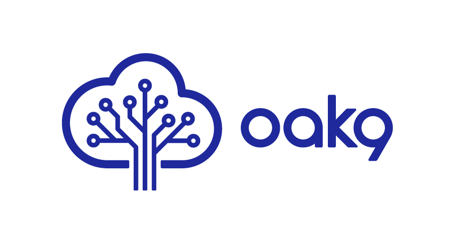
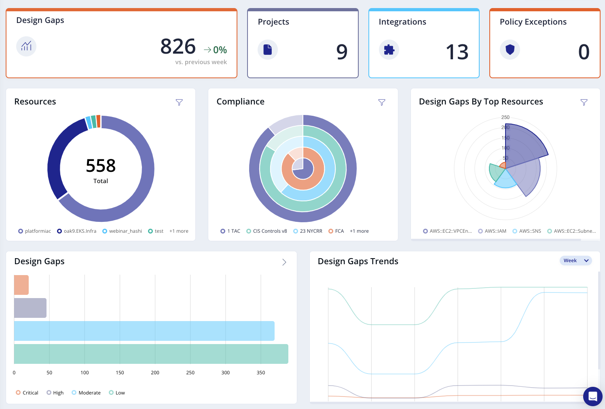
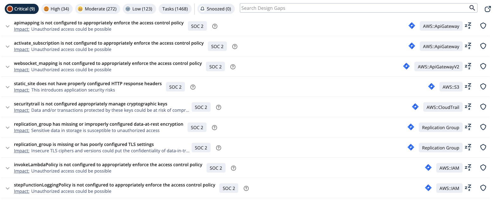

# oak9cli



`oak9cli` is a command-line utility that scans your IaC for security vulnerabilites. Please visit [home page](https://oak9.io) for more info.

## Installation

### Binary release

To install `oak9cli`, you can download the latest binary release from the [releases page](https://github.com/oak9io/oak9.cli-public/releases).

## Usage

The basic usage of `oak9cli` is as follows:

```bash
./oak9 scan -p "{Project_ID}" -k "{APIToken}" -d "{DirectoryPath}"
```

Available Commands:

- `completion`: Generate the autocompletion script for the specified shell
- `configure`: Configure oak9 cli settings
- `help`: Help about any command
- `scan`: Scan a given IaC directory and report on security violations

Available scan flags:

- `-k, --apiKey string`: the api access key to allow access to the validation services. Provided separately.
- `-d, --directory string`: (required) the root directory containing the IaC you want to scan. (default ".")
- `-e, --envId string`: The id of the environment within the organization to associate this validation with. Optional Parameter.
- `-h, --help`: Help for scan
- `-f, --outputFormat string`: The format to use to display validation results. Set to 'json' to save a 'validation_results.json' file instead. (default "console")
- `-p, --projId string`: The id of the project within the organization to associate this validation with. Project must already exist.


## Examples

Here's an example of using `oak9cli` to scan a directory containing Terraform:

```bash
./oak9 scan -p "{Project_ID}" -k "{APIToken} -d ./IAC/"
```

## UI




## Author

This project was created by [oak9 inc.](https://oak9.io/).

## License

This software is available under the following licenses:

- **[Apache 2.0](https://github.com/oak9io/oak9.cli-public/blob/master/LICENSE)**